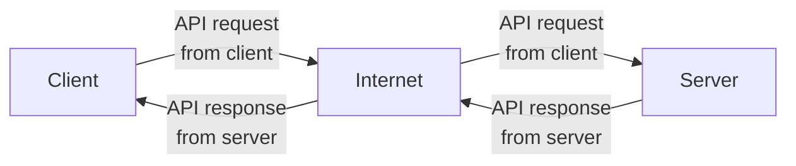

# Ebook server

This is the server for the [Thali eReader](https://github.com/TheOmnimax/ereader) app.

## About

This server is used for both uploading new books to the server and downloading books from the server to the app.

This server was built using Python, and it is hosted in Google App Engine. It uses REST API requests through FastAPI (which is built using Flask) to make requests to upload and download books.

Authentication is done through Firebase. Both downloading and uploading ebooks requires authentication, which is checked using middleware.

## Documentation files

Documentation files can be found in [this folder](https://github.com/TheOmnimax/ebook-server/tree/main/docs).

**[data_flow](https://github.com/TheOmnimax/ebook-server/tree/main/data_flow)**: Graphs describing the data workflow.

**server_utils**: Details about the [server_utils](https://github.com/TheOmnimax/ebook-server/tree/main/server_utils) directory.

## System diagram

## Future improvements

 * Add authentication for uploaded so only certain users are allowed to upload ebooks.
 * Add checks to make sure ebook is not intercepted in-transit, so ebooks downloaded from the server can only be read in the app, and not extracted to be read elsewhere.