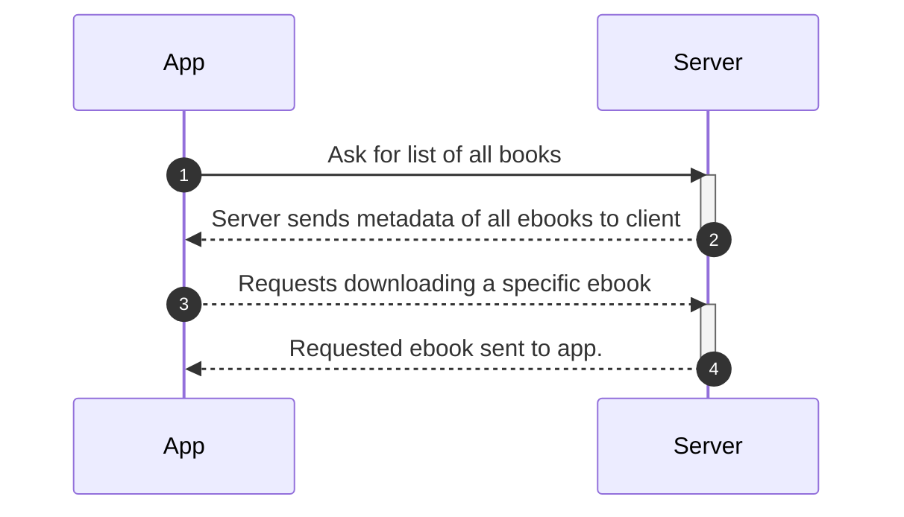
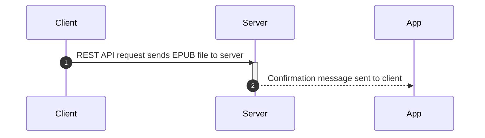

# Sequence diagrams

A solid line is an action initiated by the user, and a dotted line is an action initiated automatically by the app or the server.

## Download ebook

```mermaid
sequenceDiagram
autonumber
  App->>Server: Ask for list of all books
  activate Server
  Server-->>App: Server sends metadata of all ebooks to client
  deactivate Server
  App-->>Server: Requests downloading a specific ebook
  activate Server
  Server-->>App: Requested ebook sent to app.
  deactivate Server
```

## Upload ebook

```mermaid
sequenceDiagram
autonumber
  Client->>Server: REST API request sends EPUB file to server
  activate Server
  Server-->>App: Confirmation message sent to client
  deactivate Server
```